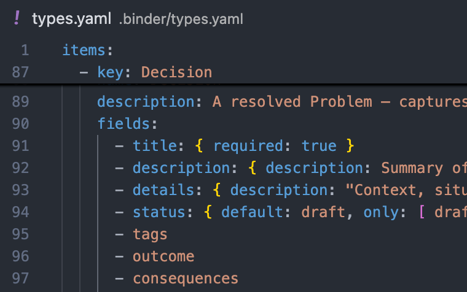
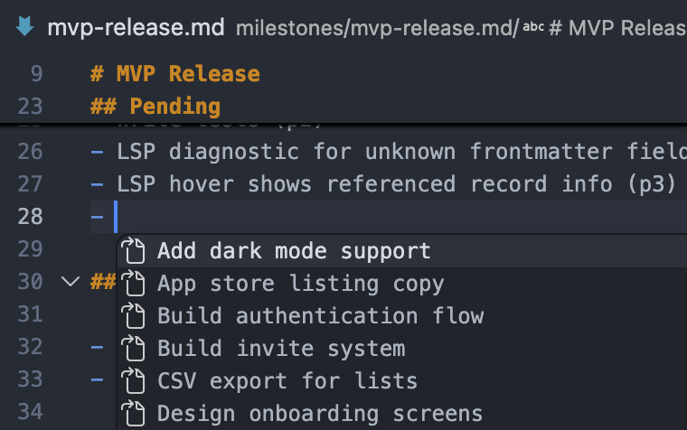
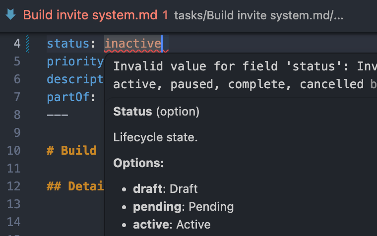
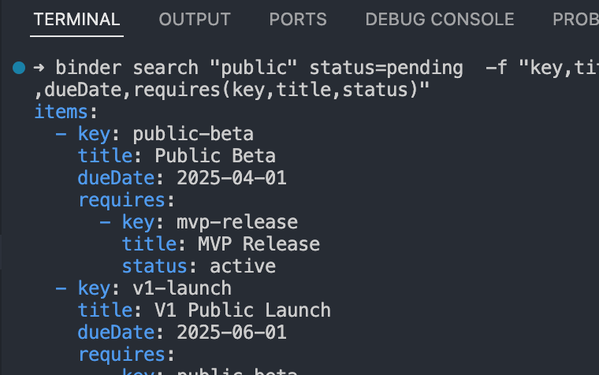
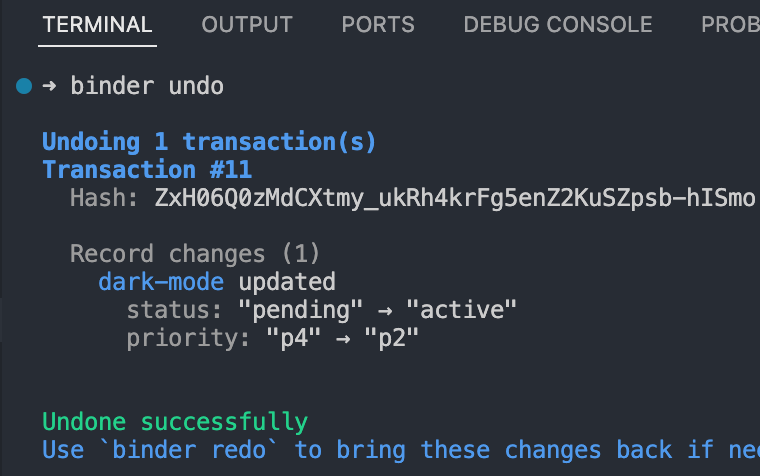
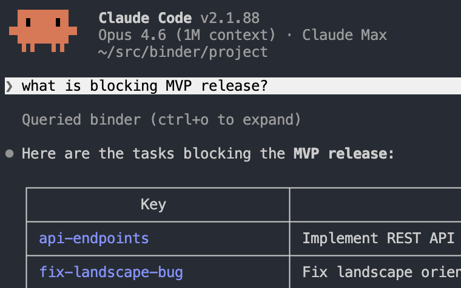

<div align="center">

<picture>
  <source media="(prefers-color-scheme: dark)" srcset=".github/assets/logo-dark.svg">
  
</picture>

# Binder
### Headless Knowledge Base for You and Your Agents

**Local-first** knowledge base with **bidirectional Markdown sync** — edit in any coding editor, query via **CLI** and **MCP**, share with AI agents.

[](https://opensource.org/licenses/MIT)
[](https://bun.sh)
[](https://www.typescriptlang.org/)
[]()

[Features](#features) • [Getting Started](#getting-started) • [How it works](#how-it-works) • [Working with Binder](#working-with-binder) • [Roadmap](#roadmap)

</div>

---

> [!WARNING]  
> **This project is currently in early development.**  
> Internal data structures, configuration formats, and APIs are subject to breaking changes.  
> **Data loss is possible.** Do not use for critical data without independent backups.

<div align="center">
  <video autoplay loop muted playsinline width="720">
    <source src="https://assets.binder.do/binder-demo.webm" type="video/webm">
    <source src="https://assets.binder.do/binder-demo.mp4" type="video/mp4">
  </video>
</div>

## Features

<table>
  <tr>
    <td align="center" valign="top" width="50%">
      <br/>
      <b>Data models</b> - define your types and fields in a simple YAML schema. Easy to write, easy to evolve.
    </td>
    <td align="center" valign="top" width="50%">
      <br/>
      <b>Autocomplete</b> - links, field names, and valid values completed as you type.
    </td>
  </tr>
  <tr>
    <td align="center" valign="top" width="50%">
      <br/>
      <b>Editor integration</b> - data validation, navigation, autocomplete in your favorite editor.
    </td>
    <td align="center" valign="top" width="50%">
      <br/>
      <b>CLI</b> - search, query, and create from the terminal or script.
    </td>
  </tr>
  <tr>
    <td align="center" valign="top" width="50%">
      <br/>
      <b>Transaction log</b> - every change recorded and attributed to its source. Audit history, undo mistakes, replay any past state.
    </td>
    <td align="center" valign="top" width="50%">
      <br/>
      <b>AI agents</b> - query, create, and update entities via MCP with full audit trail.
    </td>
  </tr>
</table>

## Use cases

- **Templated notes**: tasks, decisions, contacts, meeting notes. Any collection where every file follows the same shape benefits from schema validation, autocomplete, and queryability.
- **Embedded views**: write an entity once and have it appear in multiple documents. Views pull entity data into milestone pages, project overviews, and weekly summaries automatically.
- **Human-agent collaboration**: Markdown keeps things readable for people. CLI & MCP give agents a structured interface to **the same structured data**. Agents can write unexpected or incorrect data. Binder records every agent action with its source: audit what was written, undo any mistake, replay any past state.
- **Scripting and automation**: query structured data via CLI or API without parsing Markdown. Changes write back to files automatically. Binder is the storage layer your tooling has been missing.
- **Persistent agent memory**: agents forget between sessions. Binder gives them typed, queryable memory that persists. Preferences, decisions, and indexed context stay structured, not buried in a chat log.

## Getting Started

**1. Install Binder**

```bash
npm install -g @binder.do/cli
```

<details>
<summary>Install with Bun</summary>

```bash
bun install -g @binder.do/cli
```

</details>

**2. Set up a workspace**

```bash
binder init
```

The setup wizard will prompt you to pick a blueprint: a starter schema for common use cases like project management or personal notes.

**3. Editor extension**

Adds autocomplete for field names and valid values, inline validation, and syncs file edits back to the database on save.

- **VS Code**: install the [Binder extension](https://marketplace.visualstudio.com/items?itemName=Binder.binder-vscode). Activates automatically in any Binder workspace.

<details>
<summary>WebStorm / IntelliJ</summary>

Install the [LSP4IJ](https://plugins.jetbrains.com/plugin/23257-lsp4ij) plugin, then add a new language server under **Settings → Languages & Frameworks → Language Servers**:

- **Command**: `binder lsp`
- **File patterns**: `*.md`, `*.yaml`

</details>

<details>
<summary>Neovim</summary>

```lua
require('lspconfig').configs.binder = {
  default_config = {
    cmd = { 'binder', 'lsp' },
    filetypes = { 'markdown', 'yaml' },
    root_dir = require('lspconfig.util').root_pattern('.binder'),
  },
}
require('lspconfig').binder.setup({})
```

</details>

## How it works

Binder stores your data as a graph of [**entities**](docs/concepts/entity.md): each one a flexible collection of field-value pairs classified by a [**type**](docs/concepts/type.md) like Task, Decision, or Contact. [**Fields**](docs/concepts/field.md) are defined once and reused across types. [**References**](docs/concepts/reference.md) link entities directly, forming the graph. Types and fields are defined in `.binder/types.yaml`:

```yaml
items:
  - key: Task
    fields:
      - title: { required: true }
      - status: { only: [pending, active, complete] }
      - priority
      - partOf: { only: [Milestone] }
      - requires: { only: [Task] }
```

Editors, scripts, and agents all write to the same data. When something goes wrong, you need to know what changed and undo it. Binder records every change as an immutable [**transaction**](docs/concepts/transaction.md), attributed to its source. Full history, undo and redo, replay to any past state.

Markdown files are a view over this graph. [**Navigation**](docs/concepts/navigation.md) rules define where each entity lives on disk. Change a field value and Binder moves the file automatically:

```yaml
items:
  - where: { type: Task, status: { op: in, value: [pending, active] } }
    path: tasks/{priority} {key}
  - where: { type: Task, status: complete }
    path: archive/tasks/{key}
```

→ [Browse all concepts](docs/concepts/)

## Working with Binder

The same knowledge graph is accessible through three interfaces. Use whichever fits the task.

### Editors

Open any Markdown file in your coding editor to read, adjust, and review. Binder's LSP provides **validation, autocomplete, and navigation** across all entity files.

Install the [VS Code extension](https://marketplace.visualstudio.com/items?itemName=Binder.binder-vscode) to get started — or see [Getting Started](#getting-started) for WebStorm/IntelliJ and Neovim setup.


### AI Agents

For autonomous work: querying context, capturing decisions, writing new entities. Agents can use the **CLI directly** or connect via MCP for a typed read/write API.

Add to `.mcp.json` to enable MCP:

```json
{
  "mcpServers": {
    "binder": {
      "type": "stdio",
      "command": "binder",
      "args": ["mcp"]
    }
  }
}
```

**Skills** load Binder's CLI and data model into an agent's context, so it can query, create, and update records without extra instructions in every prompt.

```bash
npx skills add mpazik/binder
```

### Scripts and Automation

For pipelines, batch operations, and reports. Query, create, and update records without parsing Markdown. Changes write back to files automatically.

```bash
$ binder search type=Task status=active -f "title,status,priority,partOf(title,status)"
```

```yaml
items:
  - title: Add dark mode support
    status: active
    priority: p2
    partOf:
      title: MVP Release
      status: active
```

Pipe to any tool:

```bash
$ binder search type=Task status=active -q | jq '.items[] | .key + ": " + .title'
"setup-auth: Set up authentication"
"fix-layout-bug: Fix layout orientation bug"
```

Create and update without opening a file:

```bash
$ binder create Task dark-mode title="Add dark mode support" status=active priority=p2 partOf=mvp-release
$ binder update dark-mode status=complete
```

## Roadmap

### Next
- More blueprints and examples
- HTTP API
- TypeScript library
- Hooks
- Full-text and semantic search
- Transaction log compaction

### Future
- Cross-device synchronisation
- E2E encrypted backup
- Encrypted fields
- Web / Mobile UI

## Contributing

Binder is early-stage and actively shaped by feedback. Found a bug or have an idea? [Open an issue](https://github.com/mpazik/binder/issues). All input welcome.

## License

[MIT](LICENSE)
